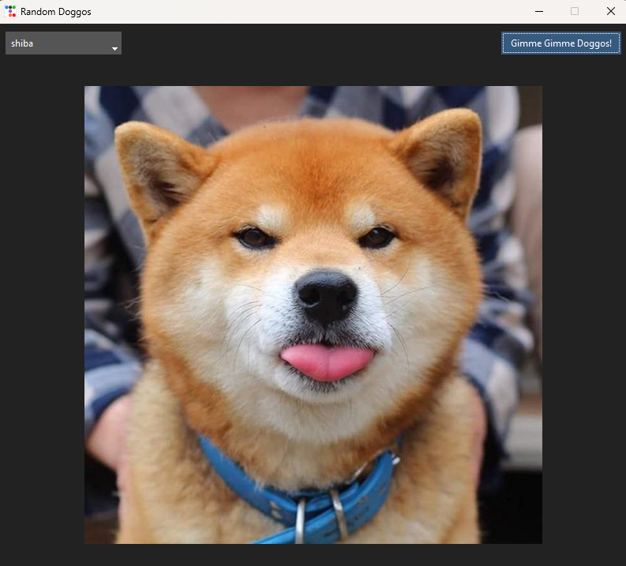

# Random Doggos
It's a simple little app, that allows you to enjoy a whole lot of pictures with random doggos! I made
it for my girlfriend and decided to share the source code, so that anyone can use it and maybe build
on it/change it!



# Key Features
The app comes with one button and one dropdown menu. Just choose your favourite dog breed or leave
the filter at random and click away, drawing from the <almost> endless pool of dog pics :))

# Project setup
To set up this project locally run:
```
cd <path/to/project/dir>
git clone https://github.com/JulianKonowalski/RandomDoggos.git
cd random_doggos
python3 -m .venv venv           # optional - activate python's virtual env
pip install requirements.txt
```

Building the app is as simple as running
```
pyinstaller src/main.py --noconfirm --onefile --windowed
```
from the project's root directory but be careful - some systems can flag the executable file as a
trojan virus (some files can be temporarily uncompressed at runtime, so it kinda works like a trojan).
If that's the case, you can always run the main.py file directly:
```
python3 -m src/main.py
```